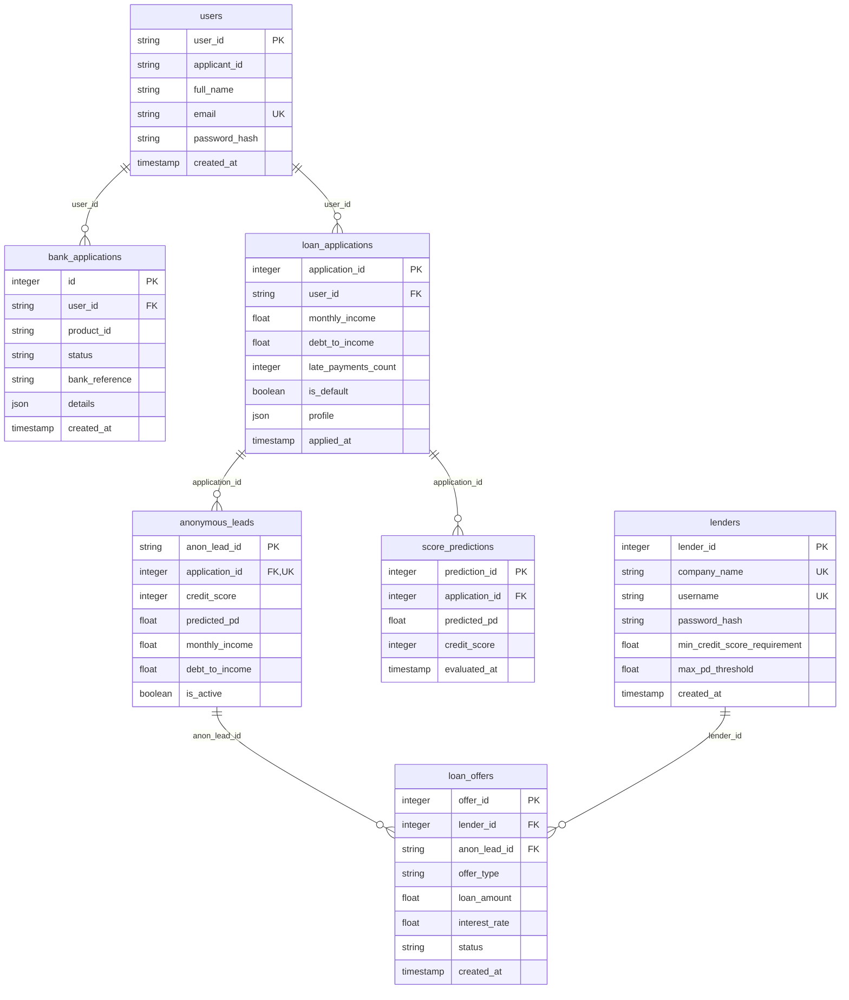

# AltCredit ER diagram

Generated from `app/models.py` by `scripts/generate_er_diagram.py`. Renders on GitHub and in VS Code (Mermaid).

```mermaid
erDiagram
    users ||--o{ bank_applications : "user_id"
    users ||--o{ loan_applications : "user_id"
    loan_applications ||--o{ anonymous_leads : "application_id"
    loan_applications ||--o{ score_predictions : "application_id"
    anonymous_leads ||--o{ loan_offers : "anon_lead_id"
    lenders ||--o{ loan_offers : "lender_id"
    lenders {
        integer lender_id PK
        string company_name UK
        string username UK
        string password_hash
        float min_credit_score_requirement
        float max_pd_threshold
        timestamp created_at
    }
    users {
        string user_id PK
        string applicant_id
        string full_name
        string email UK
        string password_hash
        timestamp created_at
    }
    bank_applications {
        integer id PK
        string user_id FK
        string product_id
        string status
        string bank_reference
        json details
        timestamp created_at
    }
    loan_applications {
        integer application_id PK
        string user_id FK
        float monthly_income
        float debt_to_income
        integer late_payments_count
        boolean is_default
        json profile
        timestamp applied_at
    }
    anonymous_leads {
        string anon_lead_id PK
        integer application_id FK,UK
        integer credit_score
        float predicted_pd
        float monthly_income
        float debt_to_income
        boolean is_active
    }
    score_predictions {
        integer prediction_id PK
        integer application_id FK
        float predicted_pd
        integer credit_score
        timestamp evaluated_at
    }
    loan_offers {
        integer offer_id PK
        integer lender_id FK
        string anon_lead_id FK
        string offer_type
        float loan_amount
        float interest_rate
        string status
        timestamp created_at
    }
```
