# AltCredit Backend — Module & Script Guide

A complete walkthrough of every file in `backend/`: what it does, what it depends on, and how requests flow through it. Diagrams are Mermaid (render in GitHub, VS Code, or any Mermaid viewer).

> **Note on "scripts":** there is no `scripts/` directory (the README mentions `scripts/generate_er_diagram.py` and `docs/er_diagram.md`, but neither existed before this file). In this guide, "script" = each individual `.py` file.

---

## Table of contents

1. [What the backend is](#1-what-the-backend-is)
2. [Architecture at a glance](#2-architecture-at-a-glance)
3. [Directory map](#3-directory-map)
4. [Startup sequence](#4-startup-sequence)
5. [`core/` — infrastructure](#5-core--infrastructure)
6. [`app/` — the FastAPI layer](#6-app--the-fastapi-layer)
7. [`services/` — business logic](#7-services--business-logic)
8. [`bank_mock/` — the partner bank](#8-bank_mock--the-partner-bank)
9. [`tests/`](#9-tests)
10. [Non-code files](#10-non-code-files)
11. [End-to-end flows (sequence diagrams)](#11-end-to-end-flows)
12. [Data model (ER diagram)](#12-data-model)
13. [The scoring model in detail](#13-the-scoring-model-in-detail)
14. [Endpoint → module map](#14-endpoint--module-map)
15. [Quirks, gaps and things to know](#15-quirks-gaps-and-things-to-know)

---

## 1. What the backend is

A **FastAPI + SQLite** service implementing a rule-based "New-Age" credit score (0–1000) for people with thin credit files. It:

- scores a user from 15 behavioural/demographic features via a tiered rule engine,
- explains the score factor by factor,
- lets the user run **what-if** simulations and get a **counterfactual plan** ("what must change to qualify for product X"),
- matches the user to products and hands off to a **separate partner-bank API** for pre-approval,
- exposes an **anonymised lender portal** where lenders push offers; identity is revealed only after the user accepts,
- produces a **PDF transparency report** and JSON export.

There are **two independent FastAPI apps**: the main API (`app.main:app`, port 8000) and the bank (`bank_mock.main:app`, port 8001).

---

## 2. Architecture at a glance

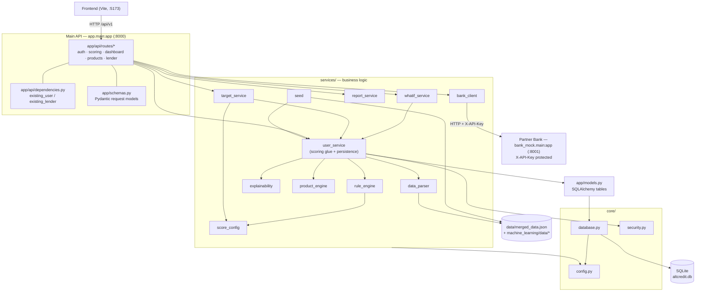

**Layering rule of thumb:** routes are thin (validate → call a service → shape JSON). All scoring logic lives in `services/`. `core/` is shared plumbing. `models.py` is the only place tables are defined.

---

## 3. Directory map

```
backend/
├── app/
│   ├── main.py                 FastAPI app factory, lifespan, CORS, router wiring
│   ├── models.py               SQLAlchemy ORM tables (7)
│   ├── schemas.py              Pydantic request bodies
│   └── api/
│       ├── dependencies.py     existing_user / existing_lender (404 guards)
│       └── routes/
│           ├── auth.py         login, register
│           ├── scoring.py      score, history, profile, CSV upload, what-if, target, PDF, JSON
│           ├── dashboard.py    one-call dashboard payload
│           ├── products.py     catalog, recommendations, bank apply, user-side offers
│           └── lender.py       anonymised candidate search, offers, contact reveal
├── core/
│   ├── config.py               Settings (env / .env)
│   ├── database.py             Engine, session, init_db, lightweight auto-migration
│   └── security.py             PBKDF2 hashing, anonymous-id generator
├── services/
│   ├── score_config.py         Tier tables & thresholds (the rule book)
│   ├── rule_engine.py          Applies the rule book → score + breakdown
│   ├── explainability.py       Breakdown → human-readable factor analysis
│   ├── product_engine.py       Score → eligible / next products
│   ├── data_parser.py          Loaders, normalisation, transactions → features
│   ├── user_service.py         Orchestrator: score + PD + explain + recommend + persist
│   ├── whatif_service.py       Simulate edits, diff before/after
│   ├── target_service.py       Counterfactual planner
│   ├── report_service.py       PDF report, JSON export, ACCEPT/REJECT verdict
│   ├── bank_client.py          HTTP client for the partner bank
│   └── seed.py                 Idempotent seeding of 500 users + 3 lenders
├── bank_mock/main.py           The "bank" — separate FastAPI app
├── tests/                      conftest + test_api / test_lender / test_scoring
├── data/merged_data.json       500 synthetic users (seed source)
├── .env.example  .gitignore  pyproject.toml  requirements.txt  README.md
```

---

## 4. Startup sequence

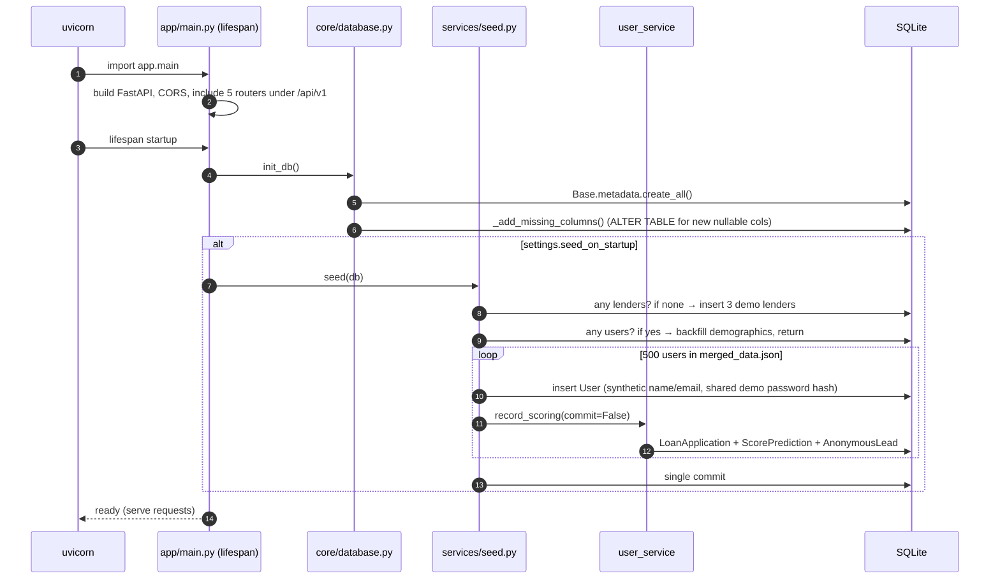

Seeding is **idempotent**: the second start finds users/lenders already there and does nothing (except back-filling demographics on older DB files).

---

## 5. `core/` — infrastructure

### `core/config.py`
Defines a `pydantic-settings` `Settings` class; every value is overridable via environment or `backend/.env`. Exposes a module-level singleton `settings` (cached via `lru_cache`).

| Setting | Default | Purpose |
|---|---|---|
| `app_name`, `api_prefix` | `AltCredit API`, `/api/v1` | Title, route prefix |
| `data_dir` | `<repo>/machine_learning/data` | Product catalog, transactions, ground-truth CSVs |
| `merged_data_path` | `backend/data/merged_data.json` | Seed users |
| `database_url` | `sqlite:///backend/altcredit.db` | Embedded DB |
| `seed_on_startup` | `True` | Run `seed.seed()` at boot |
| `pbkdf2_iterations` | `200_000` | Password hash cost (tests drop it to 1000) |
| `demo_password` | `altcredit-demo` | Password for all seeded users/lenders |
| `bank_api_url` / `bank_api_key` / `bank_timeout_seconds` | `:8001` / `dev-only-bank-key` / `5.0` | Partner-bank integration |
| `cors_origins` | `localhost:5173`, `127.0.0.1:5173` | Allowed frontend origins |

### `core/database.py`
- `Base` — SQLAlchemy 2.0 `DeclarativeBase` all models inherit from.
- `engine` / `SessionLocal` — adds `check_same_thread=False` for SQLite; `autoflush=False`, `expire_on_commit=False`.
- `get_db()` — FastAPI dependency: yields a session, always closes it.
- `init_db()` — imports `app.models` (to register tables), `create_all`, then `_add_missing_columns()`.
- `_add_missing_columns()` — a **mini-migration**: `create_all` ignores existing tables, so for each model column not present in the live table it issues `ALTER TABLE … ADD COLUMN`. Only safe for nullable / defaultable additions; it never drops or alters.

### `core/security.py`
- `hash_password(password, salt=None)` → `"<salt>$<pbkdf2-sha256 hex>"` (stdlib only).
- `verify_password(password, stored)` → constant-time compare via `hmac.compare_digest`; returns `False` for empty/malformed hashes.
- `new_anon_id(existing)` → `ANON-XXXXXX` (3 random bytes, hex upper), retried until unique. This is the pseudonym lenders see.

---

## 6. `app/` — the FastAPI layer

### `app/main.py`
Creates the app, attaches `CORSMiddleware`, defines `GET /health`, and mounts the five routers under `/api/v1`. The `lifespan` hook runs `init_db()` + optional seeding (see [§4](#4-startup-sequence)).

### `app/models.py` — tables
Seven SQLAlchemy models (full ER diagram in [§12](#12-data-model)):

| Model | Table | Role |
|---|---|---|
| `User` | `users` | Account + demographics. String PK (`USR_001`). `applicant_id` is a UUID used as the pseudonymous id sent to the bank. |
| `LoanApplication` | `loan_applications` | One row **per scoring event**; stores the full feature snapshot in a `profile` JSON column. The *latest* row is the user's current profile. |
| `ScorePrediction` | `score_predictions` | Score + PD for an application (history source). |
| `AnonymousLead` | `anonymous_leads` | The lender-facing pseudonym (`ANON-…`): score, PD, income, DTI only. One per user (unique `application_id`), refreshed on each re-score. |
| `Lender` | `lenders` | Lender account + policy (`min_credit_score_requirement`, `max_pd_threshold`). |
| `LoanOffer` | `loan_offers` | Offer from lender → lead. Status `OFFERED → ACCEPTED/DECLINED`. |
| `BankApplication` | `bank_applications` | Result of a user's apply-click against the bank API. |

### `app/schemas.py` — request validation
| Schema | Used by | Notes |
|---|---|---|
| `LoginIn` | `/auth/login` | `role: user\|lender` |
| `ProfileIn` | `PUT /scoring/{id}/profile` | All fields optional, bounded (e.g. `age 18–100`, rates `0–1`), `extra="forbid"` |
| `RegisterIn` | `/auth/register` | Extends `ProfileIn` + `full_name`, `email` (regex), `password` (≥8) |
| `WhatIfIn` | `/what-if` | `changes` (absolute) and/or `deltas` (relative) |
| `ApplyIn` | `/products/{id}/apply` | `product_id` |
| `OfferResponseIn` | `/offers/{id}/respond` | `ACCEPTED \| DECLINED` |
| `OfferPushIn` | lender `POST /offers` | 1–500 lead ids, amount > 0, rate 0–100, `Loan\|Credit Card` |

### `app/api/dependencies.py`
`existing_user(user_id)` and `existing_lender(lender_id)` — path-param dependencies that load the row or raise **404**. Every user/lender route uses them, so "does this id exist" is centralised.

### `app/api/routes/auth.py`
| Endpoint | Behaviour |
|---|---|
| `POST /auth/login` | Looks up lender by `username` or user by id/email (lower-cased); verifies password; returns `{role, subject}`. **No token.** Same 401 message for unknown account and wrong password (no user enumeration). |
| `POST /auth/register` | 409 on duplicate email; generates next `USR_nnn` id (skips collisions); creates `User`; calls `user_service.record_scoring` on the submitted profile; returns score, tier and `missing_fields`. |

### `app/api/routes/scoring.py`
| Endpoint | Behaviour |
|---|---|
| `GET /scoring/{id}` | Full `score_user` result: score, tier, PD, pillars, sub-factors, explanation, recommendations. |
| `GET …/history` | Chronological list of stored predictions. |
| `PUT …/profile` | Merge partial `ProfileIn` over the current profile, re-score, **persist a new application row**. |
| `POST …/transactions` | Upload CSV (≤ 5 MB → 413; unparseable → 422); derive features via `data_parser`; merge over profile; re-score & persist. |
| `POST …/what-if` | Validates keys against `REQUIRED_KEYS`, delegates to `whatif_service.simulate`. **Never persists.** |
| `GET …/target?product_id=` | 404 if product unknown; `target_service.plan_for_target`. |
| `GET …/report.pdf` | `report_service.build_pdf` → `application/pdf` attachment. |
| `GET …/export.json` | `report_service.profile_export`. |

### `app/api/routes/dashboard.py`
`GET /dashboard/{id}` — one call assembling: score + verdict (`ACCEPT/REJECT`), score bands, pillars, drivers (top positive / negative / weak / all), next steps (eligible products, next product, suggestions), history, `has_pending_offers`, data completeness. Saves the frontend from making 5 requests.

### `app/api/routes/products.py`
| Endpoint | Behaviour |
|---|---|
| `GET /products` | Static catalog (4 products, cached). |
| `GET /products/{id}/recommendations` | Live-score product matches (light path, no explanation). |
| `POST /products/{id}/apply` | 404 unknown product; **409 if score < product min**; calls `bank_client.request_preapproval`; persists a `BankApplication`; **502** if bank unreachable. |
| `GET /products/{id}/offers` | Offers lenders pushed to this user (joins Offer→Lender→Lead→Application→User). |
| `POST /products/{id}/offers/{oid}/respond` | 404 if offer isn't theirs; 409 if not `OFFERED`; sets `ACCEPTED/DECLINED`. **Accepting = de-anonymisation.** |

### `app/api/routes/lender.py`
Router prefix `/lender/{lender_id}`.

| Endpoint | Behaviour |
|---|---|
| `GET ""` | Lender profile + policy. |
| `GET /candidates` | Search over `AnonymousLead` (active only). Filters: `min/max_score`, `max_pd`, `min_income`, `max_dti`; `only_qualifying` (default true) also applies the lender's own score/PD policy; sort + pagination (`limit ≤ 200`). |
| `GET /candidates/{anon_id}` | Re-scores the lead's stored profile → pillar & sub-factor breakdown, top 3 factors, `qualifies` flag. **No identity fields.** |
| `POST /offers` | Bulk push. Per lead: skipped if not found, fails lender policy, or an open offer already exists. Returns `{created, skipped[reason]}`. |
| `GET /offers` | Lender's offers (optional status filter). `contact` is `null` **unless status = ACCEPTED**, then `{full_name, email}`. |

`_lead_view()` is the anonymisation choke-point: it returns only `anon_lead_id, credit_score, risk_tier, predicted_pd, monthly_income, debt_to_income`.

---

## 7. `services/` — business logic

### `services/score_config.py` — the rule book
Pure constants; no logic. Every threshold and point value the engine uses.

| Pillar | Factor | Max pts | Rule shape |
|---|---|---|---|
| **Lifestyle** (350) | 1.1 Employment stability | 150 | ≥24mo=150, ≥12=100, ≥6=50 |
| | 1.2 Housing | 80 | owner=80; renter ≥12 on-time months=60, else 30; none=0 |
| | 1.3 Digital footprint | 70 | ≥95%=70, ≥80=45, ≥60=20 |
| | 1.4 Education | 50 | phd/master=50, bachelor=40, cert/diploma=30, high school=20 |
| **Spending** (350) | 2.1 Spend-to-income | 120 | ≤30%=120, ≤50=80, ≤70=40 |
| | 2.2 Expense diversity (essential share) | 80 | ≥70%=80, ≥55=45, ≥40=20 |
| | 2.3 Cash-flow volatility | 70 | ≤5%=70, ≤10=40, ≤20=15 |
| | 2.4 Savings buffer | 80 | ≥180d=80, ≥90=50, ≥30=20 |
| **Repayment** (570) | 3.1 On-time rate | 200 | ≥98%=200, ≥95=150, ≥90=100, ≥80=50 |
| | 3.2 Debt-to-income | 120 | ≤20%=120, ≤35=80, ≤50=40 |
| | 3.3 Credit utilisation | 100 | ≤10%=100, ≤30=70, ≤50=30 |
| | 3.4 Delinquency | 150 | clean=150, 30d=100, 60d=50, 90+=0 |
| **Adjustments** | 4.1 Positive habits | +50 cap | 20/habit |
| | 4.2 Risk flags | −50 cap | 20/flag |

Also `MIN/MAX_CREDIT_SCORE` (0/1000) and `RISK_TIERS` (≥750 Prime, ≥650 Near-Prime, ≥550 Sub-Prime, else High Risk).

### `services/rule_engine.py`
`AltCreditRuleEngine.evaluate_user(user_data)` — reads the tier tables from `score_config` (injected as `cfg`, so alternative configs are testable), walks each of the 14 factors in order, first matching tier wins, and returns:

```
{ user_id, applicant_id, final_credit_score, risk_tier,
  pillar_breakdown: {lifestyle_score, spending_behavior_score,
                     repayment_discipline_score, net_adjustments},
  subfactor_breakdown: { "1.1_employment_stability": {score, max, val}, … } }
```

The final score is `clamp(sum of pillars, 0, 1000)`. Module exposes a singleton `engine`; `from services.rule_engine import c` re-exports the config for callers (dashboard, lender, target service).
**It indexes keys directly** — a missing key raises `KeyError`, which is why `normalise_profile` must run first.

### `services/data_parser.py`
Three jobs:

1. **Normalisation** — `normalise_profile(raw) → (profile, missing_fields)`. Fills every required key, clamps to bounds, uses conservative defaults (score 0 points). Deliberate exceptions: `credit_util` and `delinq_*` default to "no record" (thin files legitimately have none). `monthly_spend` defaults to income (ratio 100%). `education_level` falls back to the `education` field. **Never raises on bad data.** `data_completeness()` = `1 − missing/required`.
2. **Loaders** — `load_merged_users`, `load_demographics`, `load_product_catalog`, `load_transactions` (from `settings.data_dir` / `merged_data_path`).
3. **Transactions → features** — `parse_transactions` (CSV bytes/path/JSON records; requires `date, amount, category, type`; optional `status`) and `features_from_transactions`.

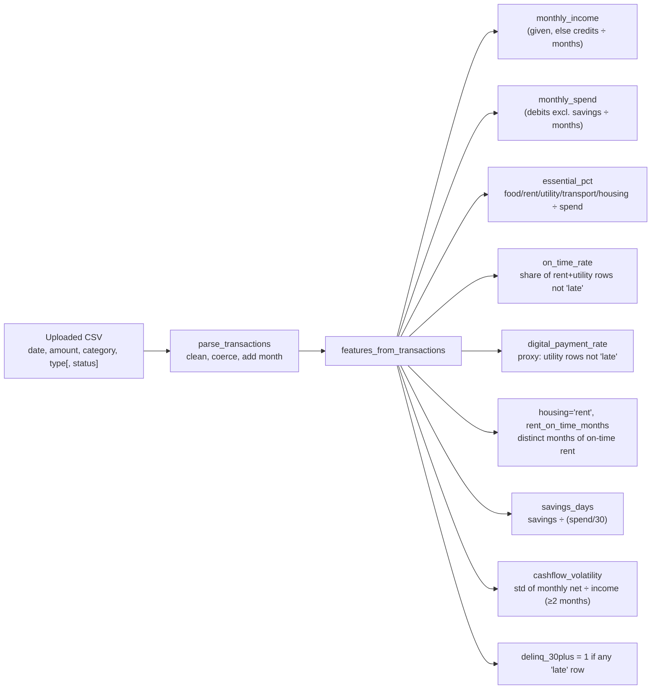

Only derivable fields are returned; the caller merges them over the existing profile (demographics/job tenure untouched).

### `services/explainability.py`
Turns the engine output into UI-ready explanations.

- `FACTOR_NAMES` / `PILLAR_NAMES` — key → display label / pillar.
- `get_contribution_type(score, max)` → `negative` / `weak` (0) / `strong` (at max) / `positive`.
- `generate_factor_explanation` — per-factor dict with a sentence like *"Employment Stability contributed +150 points. Observed value: 35 months."*
- `build_explanation(evaluation)` — buckets factors into `positive_factors`, `negative_factors`, `weak_factors` (score = 0), takes `top_contributors` (top 5), computes `contribution_percentage` (share of total positive points), and generates `improvement_suggestions` from the weak factors (`potential_points` = factor max).

### `services/product_engine.py`
`recommend_products(score, products)` splits the catalog into `eligible` (sorted highest requirement first) and `ineligible` (closest first), returning `highest_eligible_product` and `next_product` (the nearest unreachable one). Helper getters tolerate alternate key names (`id`/`code`, `name`/`title`, `minimum_score`). Eligible items carry `points_above_requirement`; ineligible carry `points_needed`.

### `services/user_service.py` — the orchestrator
The hub most routes call. Key functions:

| Function | Purpose |
|---|---|
| `product_catalog()` | Cached tuple of catalog products. |
| `probability_of_default(score)` | `1 − score/1000`, clamped 0–1 (derived, not trained — no default labels exist). |
| `score(raw, with_details=True)` | normalise → `engine.evaluate_user` → PD → `score_capped` flag → completeness → recommendations → (optionally) explanation. **Pure; no DB.** |
| `latest_application` / `current_profile` | Latest `LoanApplication.profile` + ids = the user's current raw profile. |
| `score_user(db, user)` | `score(current_profile(...))`. |
| `record_scoring(db, user, raw_profile, …)` | **The write path**: score → insert `LoanApplication` (snapshot) → insert `ScorePrediction` → create-or-refresh the user's `AnonymousLead` (re-activates it, repoints `application_id`). `known_anon_ids`/`commit=False` let the seeder batch 500 users in one transaction. |
| `score_history(db, user_id)` | Ordered predictions. |

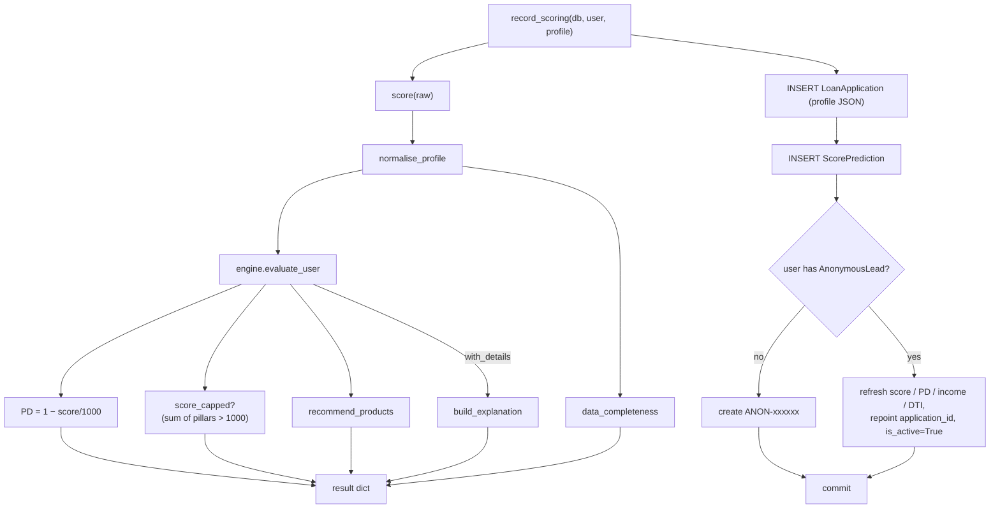

### `services/whatif_service.py`
`simulate(base_raw, changes, deltas)`:
1. normalise the base profile, apply `changes` (absolute) then `deltas` (`current + delta`);
2. score **before** and **after** with the real engine;
3. return `score_before/after`, `delta`, tier change, `factor_changes` (only factors whose points moved), `products_unlocked` / `products_revoked`, and a `cap_note` when the 1000 cap is masking gains.

The stored profile is never modified.

### `services/target_service.py`
Counterfactual planner: *smallest set of feature changes that reaches a product's minimum score.*

- `LEVERS` — 9 adjustable features, each with its config table, direction (higher/lower is better), an "effort span" for normalising cost, a label and human advice.
- Candidate values come **from the tier thresholds in `score_config`** and each is scored by the real engine — the plan cannot drift from the rules.

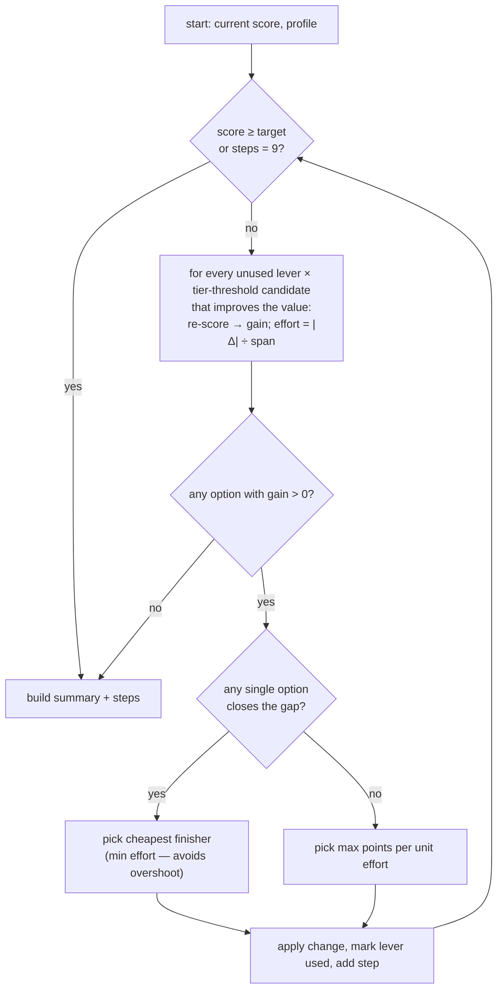

Returns `current_score, target_score, points_needed, projected_score, reachable, steps[{feature, from, to, points_gain, advice, action}], summary`.

### `services/report_service.py`
- `decision(result)` → `("ACCEPT", "Eligible for N product(s)…")` or `("REJECT", "…X more points needed for <next product>")`. Also used by the dashboard.
- `build_pdf(result, user_id)` → bytes via ReportLab: header, verdict, score & PD, pillar table, 14-factor table, top-5 improvement suggestions, missing-data note, prototype disclaimer.
- `profile_export(...)` → JSON with score, PD, breakdowns, eligible product ids, missing fields, and the raw input profile.

### `services/bank_client.py`
`request_preapproval(payload)` → `POST {bank_api_url}/v1/preapproved-offers` with `X-API-Key`. Any transport error or non-200 becomes `BankUnavailable` (routes map it to HTTP 502). `get_client()` is a seam so tests can inject an in-process bank.

### `services/seed.py`
`seed(db)` — see [§4](#4-startup-sequence). Creates 3 demo lenders (`primebank` 650/0.35, `microfin` 450/0.55, `neolend` 550/0.45 — min score / max PD), then 500 synthetic users named `Synthetic USR_nnn` with `usr_nnn@example.test`, all sharing one hashed `demo_password`. Fields in `PROFILE_SKIP` (`user_id`, `applicant_id`, `match_cost`) are excluded from the stored profile.

---

## 8. `bank_mock/` — the partner bank

`bank_mock/main.py` is a **separate FastAPI app** simulating an external bank.

- `GET /health`
- `POST /v1/preapproved-offers` — guarded by `X-API-Key` (constant-time compare, 401 otherwise).
- The bank **re-validates eligibility itself** rather than trusting the caller:
  - `credit_score < min_score_required` → `{status: DECLINED, reason, reference: null}`
  - otherwise `multiple = 1 + (score − min) / 250`;
    Credit Card → `credit_limit = round(income × 2 × multiple, −2)`;
    Loan → `approved_amount = round(income × 6 × multiple, −2)`, `tenure_months = 24`;
    `reference = BANK-<10 hex>`.
- Only pseudonymous data crosses the boundary (`applicant_id` UUID, score, income) — no name, email or account number.

---

## 9. `tests/`

| File | What it verifies |
|---|---|
| `conftest.py` | Sets a temp SQLite DB and low PBKDF2 cost **before** importing the app; a session-scoped `TestClient`; monkey-patches `bank_client.get_client` to an in-process bank; `lender_id` login helper. |
| `test_scoring.py` (7) | Engine matches the ground-truth CSVs for **all 500 users** (score, tier) and the factor-analysis CSV; `PD = 1 − score/1000`; missing data doesn't crash and never beats full data; latency budget; transaction feature derivation. |
| `test_api.py` (8) | E2E profile→dashboard, what-if, target counterfactual, login checks DB, register + CSV upload + thin file, apply via bank, bank rejects missing key, signup persists full profile. |
| `test_lender.py` (3) | Search is anonymous & filtered (no `user_id/name/email/…` keys anywhere in the payload), **offer lifecycle reveals identity only on accept**, bad input / unknown lender. |

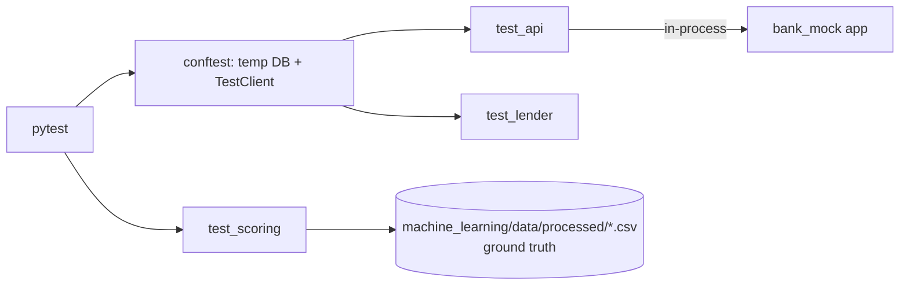

Run: `.venv/bin/python -m pytest -q`

---

## 10. Non-code files

| File | Purpose |
|---|---|
| `data/merged_data.json` | 500 users: demographics + 15 behavioural features (seed source). |
| `machine_learning/data/product_catalog.json` | 4 products: P_01 Starter Card (350), P_02 Micro-Loan Lite (550), P_03 Standard Card (650), P_04 Premium Personal Loan (750). *(outside `backend/`, read via `settings.data_dir`)* |
| `machine_learning/data/transactional_data.csv`, `processed/*.csv` | Transactions and ground-truth outputs used by tests. |
| `.env.example` | `DATABASE_URL`, `DEMO_PASSWORD`, `BANK_API_URL`, `BANK_API_KEY`. |
| `.gitignore` | `.env`, `*.db`, `__pycache__/`, `.pytest_cache/`. |
| `requirements.txt` / `pyproject.toml` | Pinned deps / stub project metadata (`dependencies = []`, Python ≥ 3.13). |
| `README.md` | Run instructions, layout, API table, assumptions. |

---

## 11. End-to-end flows

### 11.1 Login (no tokens)

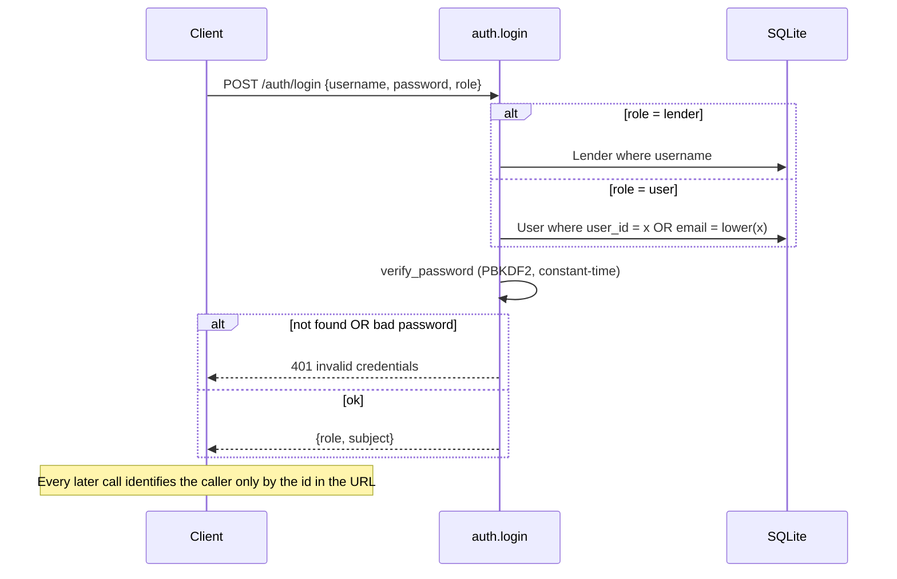

### 11.2 Scoring + dashboard

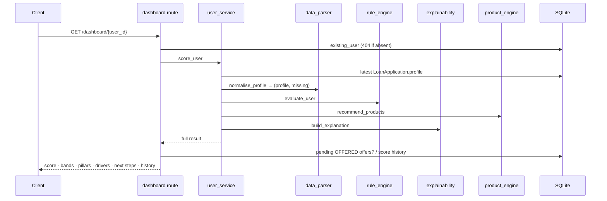

### 11.3 Profile update / CSV upload (writes)

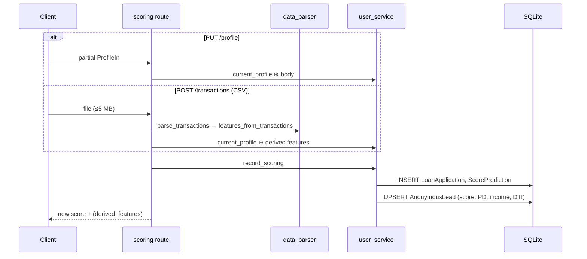

### 11.4 Apply for a product (bank hand-off)

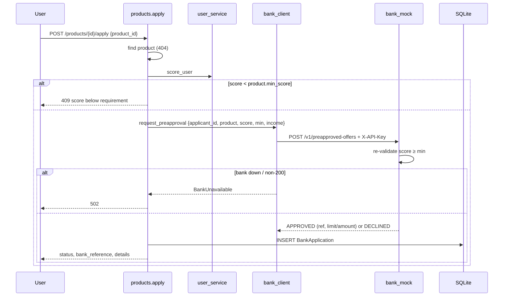

### 11.5 Lender offer lifecycle & de-anonymisation

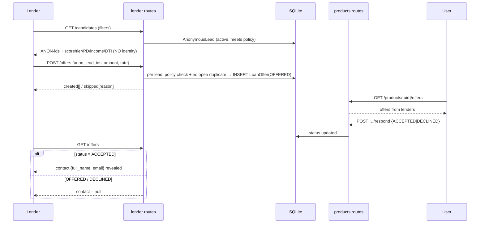

Privacy state machine for one offer:

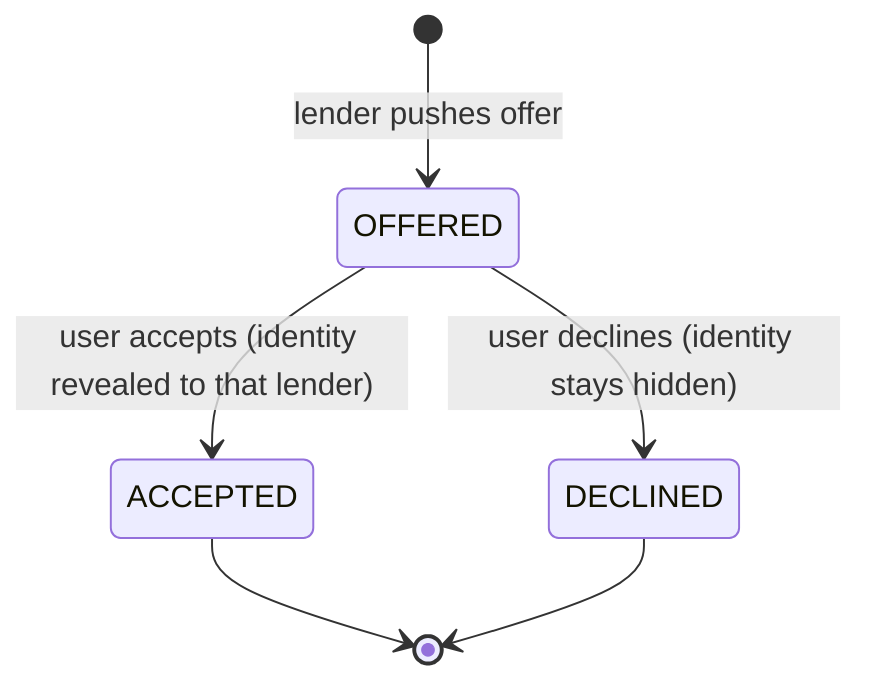

### 11.6 What-if and target planning

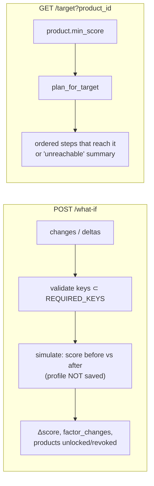

---

## 12. Data model

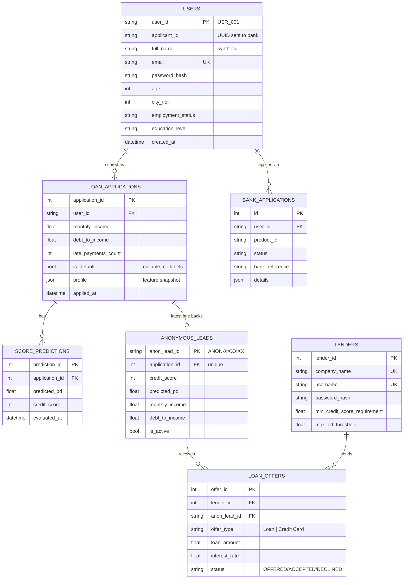

**Key design points:** each re-score adds a new `loan_applications` row (append-only history); the *latest* row is the user's live profile. A user has exactly one `anonymous_leads` row that is refreshed in place, so lender-side ids stay stable across re-scores. The only bridge from an `ANON-` id back to a person is `LoanOffer.lead → application → user`, and it is only dereferenced when `status == ACCEPTED`.

---

## 13. The scoring model in detail

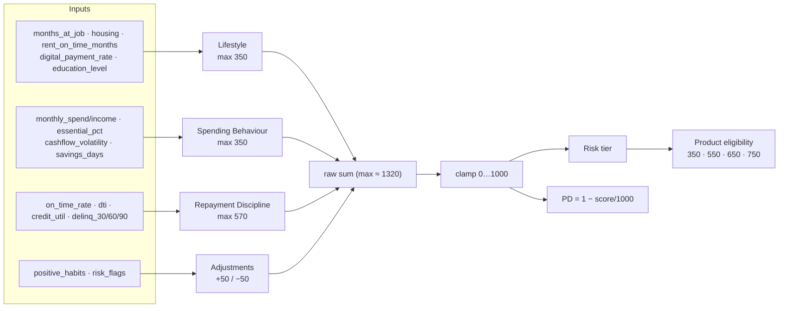

- **Tier mechanics:** for each factor the first matching tier in the config list wins, so lists are ordered best → worst.
- **Cap effect:** raw maxima sum to ~1320 but the score caps at 1000; `score_capped = true` when the raw sum exceeds 1000 and what-if surfaces a `cap_note`.
- **PD is derived, not modelled.** The data has no default label, so there is no trained ML model (`scikit-learn`/`joblib`/`numpy` in `requirements.txt` are currently unused by any backend code).
- **Missing data policy:** unknown → conservative default (0 points), reported in `missing_fields`, and `data_completeness` is exposed. Tests assert that incomplete data never scores higher than complete data.

---

## 14. Endpoint → module map

| Endpoint (prefix `/api/v1`) | Route file | Main services used |
|---|---|---|
| `POST /auth/login` | `auth.py` | `core.security` |
| `POST /auth/register` | `auth.py` | `security`, `user_service.record_scoring` |
| `GET /scoring/{id}` | `scoring.py` | `user_service.score_user` → `data_parser`, `rule_engine`, `explainability`, `product_engine` |
| `GET /scoring/{id}/history` | `scoring.py` | `user_service.score_history` |
| `PUT /scoring/{id}/profile` | `scoring.py` | `user_service.record_scoring` |
| `POST /scoring/{id}/transactions` | `scoring.py` | `data_parser`, `record_scoring` |
| `POST /scoring/{id}/what-if` | `scoring.py` | `whatif_service` |
| `GET /scoring/{id}/target` | `scoring.py` | `target_service` |
| `GET /scoring/{id}/report.pdf` | `scoring.py` | `report_service.build_pdf` |
| `GET /scoring/{id}/export.json` | `scoring.py` | `report_service.profile_export` |
| `GET /dashboard/{id}` | `dashboard.py` | `user_service`, `report_service.decision` |
| `GET /products` | `products.py` | `user_service.product_catalog` |
| `GET /products/{id}/recommendations` | `products.py` | `user_service.score_user` |
| `POST /products/{id}/apply` | `products.py` | `bank_client` → `bank_mock` |
| `GET /products/{id}/offers` · `POST …/respond` | `products.py` | ORM only |
| `GET /lender/{id}` … `/candidates[/{anon}]` · `/offers` | `lender.py` | `user_service.score`, ORM |
| `GET /health` | `main.py` | — |
| Bank: `POST /v1/preapproved-offers` | `bank_mock/main.py` | — (port 8001) |

---

## 15. Quirks, gaps and things to know

1. **No real authentication.** `/auth/login` returns `{role, subject}` and issues no token. Anyone who knows a `user_id` / `lender_id` can call that account's endpoints. Prototype-only, and the README says so.
2. **Doc drift:** README references `scripts/generate_er_diagram.py` and `docs/er_diagram.md`; neither exists in `backend/`. An ER diagram lives at `../Artifacts/er_diagram.md`.
3. **Unused dependencies:** `scikit-learn`, `joblib`, `numpy` are pinned but never imported. `pyproject.toml` lists `dependencies = []`, so `requirements.txt` is the real dependency source.
4. **Cross-directory data dependency:** the product catalog, transactions and ground-truth CSVs still load from `../machine_learning/data/`. Moving/deleting that folder breaks product matching (and therefore scoring output) and the ground-truth tests.
5. **Proxy features from CSV upload:** `digital_payment_rate` is approximated by on-time *utility* payments; `delinq_30plus` is set to 1 if *any* row is `late` (the feed has no days-late column); `housing` is forced to `"rent"` if any on-time rent exists.
6. **What-if key validation** accepts only `REQUIRED_KEYS` (the 15 numeric + `monthly_spend` + `housing` + `education_level`), so demographics like `age` can't be simulated.
7. **`_add_missing_columns`** only adds columns. Renames, type changes and drops need a real migration tool (e.g. Alembic).
8. **Lead ↔ application coupling:** `AnonymousLead.application_id` is unique and is repointed on every re-score, so a lead always reflects the user's *latest* application.
9. **`lender.py`'s `_tiers()`** imports `rule_engine.c` lazily inside a function; harmless, but the tier list could simply be imported at the top like the other routes do.
10. **`match_cost`** appears in `PROFILE_SKIP` in the seeder — a leftover field from the earlier `machine_learning` pipeline.
